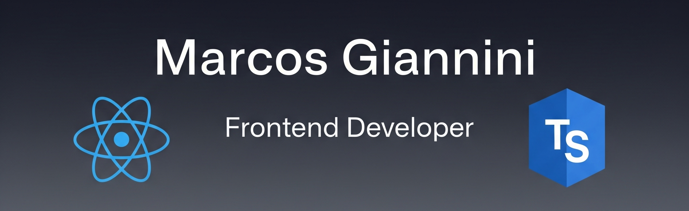

  

<h1 align="center">Marcos Giannini</h1>
<h3 align="center">Frontend Engineer (Junior) — Digital Experience @ NTT DATA</h3>

  
  &nbsp;
  

---

Frontend Engineer en NTT DATA, donde trabajo en proyectos de experiencia digital para clientes reales.
Fuera del trabajo, construyo webs propias desde cero: desde el diseño hasta el despliegue en producción.
Todo el trabajo está en **[marcosgiannini.dev](https://marcosgiannini.dev/)**.

---

### Proyectos activos

| Proyecto | Stack | Estado |
|---|---|---|
| [marcosgiannini.dev](https://marcosgiannini.dev/) | Next.js · Tailwind CSS | 🟢 En producción |
| **Super Teacher** | Next.js · Supabase · Stripe | 🔵 En desarrollo (privado) |
| [Lenoy Editorial](https://github.com/MarcosGiannini/lenoy-editorial-web) | Astro · Tailwind CSS | 🟢 Web cultural en producción |
| [Teacher Starter Kit — Maite](https://github.com/MarcosGiannini/v0-teacher-starter-kit-maite) | v0 · Next.js | 🟢 Público |

---

### Stack actual

`TypeScript` · `React` · `Next.js` · `Astro` · `Tailwind CSS`
