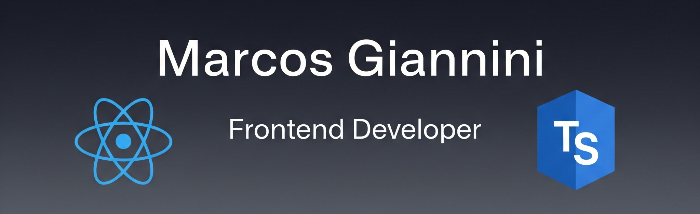

  

  
  
  

---

### 👨‍💻 Sobre Mí

Desarrollador Frontend con una sólida trayectoria de 9 años, especializado recientemente en el ecosistema moderno de JavaScript (React, TypeScript, Redux). Potencio mi productividad con un workflow AI-First usando herramientas como GitHub Copilot y Cursor.

- 🔭 Actualmente estoy colaborando en el proyecto Open Source de **Stack&Flow Design System**.
- 🌱 Mi objetivo es dominar el workflow de desarrollo asistido por IA con herramientas como **GitHub Copilot** y **Cursor**.
- 👯 Busco una **posición 100% remota** donde pueda seguir creciendo, aplicando mis nuevas habilidades y aportando mi experiencia.
- 💬 Hablemos sobre **React, TypeScript, Design Systems, o productividad para desarrolladores**.
- 📫 Cómo contactarme: **marcogfa@gmail.com**

---

### 🚀 Mi Stack Tecnológico

Aquí están las tecnologías con las que trabajo habitualmente:

  
  
  
  
  
  
  
  
   
  

  

---

### 📊 Mis Estadísticas de GitHub

Aquí puedes ver un resumen de mi actividad en la plataforma.

  

  

### 🏆 Mis Trofeos de GitHub

  

---

### 👁️ Contador de Visitas

  

